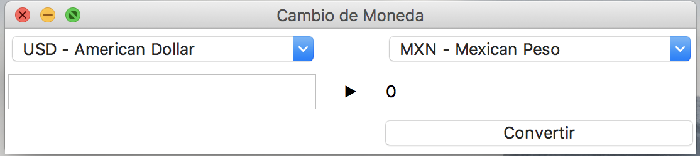
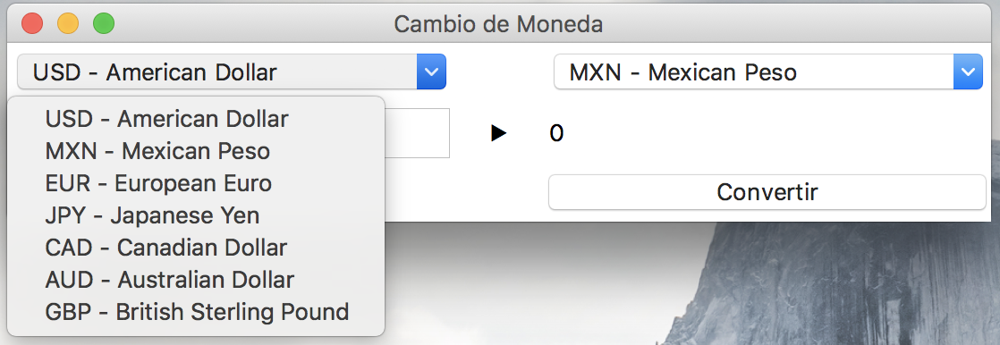
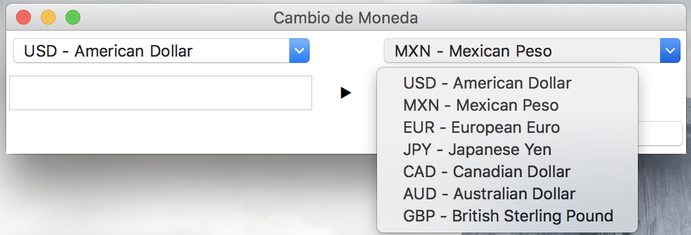

# Calculadora de monedas
Esta es una calculadora de monedas

## Nota
Para el correcto funcionamiento de esta calculadora de monedas, se debe de contar con acceso a internet.

> Los valores mostrados se calculan mediante los datos obtenidos del API de fixer.io.

----------

El usuario puede seleccionar la moneda de la cual quiere transformar la cantidad que ingresó.

----------

El usuario también tiene la opción de seleccionar la moneda a la que quiere que se transforme la cantidad que ingresó.